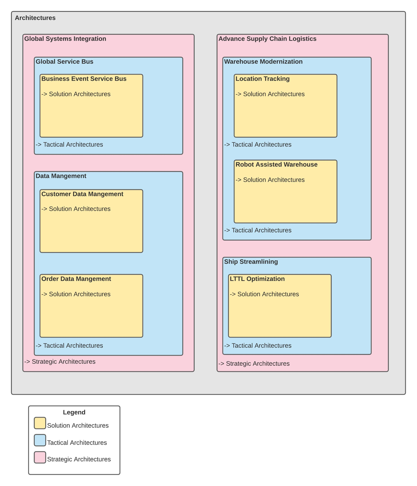
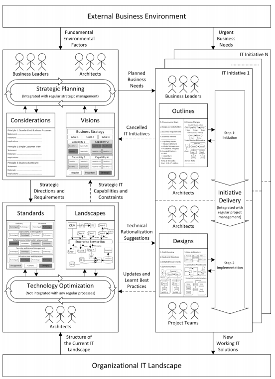
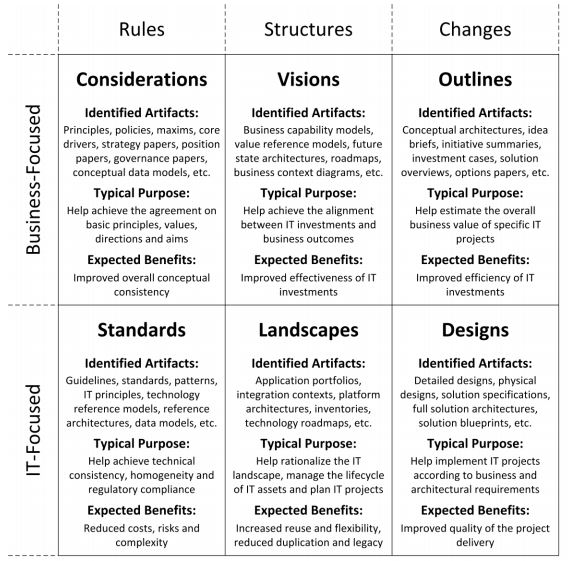

 **_(Work in progress)_**
 

# Enterprise Architecture
A blueprint for the optimal and target-conformant placement of resources in the IT environment for the ultimate support of the business function.

 * Affects all development of the company.
 * Works with high-level abstractions of the created systems.
 * Provides technical communications throughout the company.
 * Does not interact with the code.
 * Focuses on the business component.
 * Has a broad technological horizon.
 * Owns several domains.

# The Concept of Enterprise Architecture

# Levels of Enterprise Architecture.
Enterprise Architect has a number of powerful features that will assist the architecture program to partition and maintain these levels of the architecture and their inter-relationships.

 * **Strategic Architectures**: Provides a high level and often long term view of the enterprise and are used by senior business and technical stackholders to get a single view of the architecture to assist with strategic planning.
 * **Tactical Architectures**: Provide a mid-range view of the enterprise often focused on a particular area or division and provides the context for operational changes and equates to the portfolio or program level organization of projects and initiatives.
 * **Solution Architectures**: Provide a detailed view of how an enterprise can support a capability and how the parts of the architecture can be used to describe baseline and target capabilites and capability increments. These architectures will typically guilde projects that are grouped within a portfolio.

Enterprise Architect can be used to define and manage strategic level architectures and can also help to ensure tactical and solution architectures are aligned to support the strategic direction. 

This diagram shows the way architecture at different levels can be visualized.

# The Role of Enterprise Architecture Practice

# Four Stages of Architecture Maturity
  1. **Business Silios**: where companies look to maximize individual business unit needs or functional needs.
  2. **Standardized Technology**: providing IT efficientcies through technology standardization and, in most cases, increased centralization of technology management.
  3. **Optimized Core**: which provides companywide data & process standardization as appropriate for the operating model.
  4. **Business Modularity**: where companies manage and reuse loosely IT-enabled business process components to preserve global standards while enable local differences.

# Types of IT Initiatives
## Fundamentals
## Stategic
### Strategic Planning 
Strategic planning process alone neither delivers any IT solutions nor even describes what exactly needs to be delivered, but only provides high-level rules and directions for IT reflected in Considerations and Visions agreed by both business and IT.
### Initiative Delivery
Is the next downstream process which turns the abstract plans into tangible IT solutions implemented in an optimal manner. It closes the gap between Strategic planning and the actual practical implementation of working IT solutions.

### The Process View in Practice

This figure suggests, an EA practive cannot be viewed as a single step-by-step process, where architects creates numerious EA artifacts to describe all the layers of architecture from busienss to infrastructure, but rather as a complex set of diverse and interacting processes happening simultaneously organizational levels.

 ## Local
 ## Urgent
 ## Architectural

# Types Of Enterprise Architecture Artifacts

## Considerations 
are Business-Focused Rules. EA artifacts related to this general type identified in organizations include principles, policies, maxims, core drivers, architecture strategies, conceptual data models, governance papers, position papers, strategy papers and whitepapers. All these EA artifacts describe global conceptual rules and considerations important for business and relevant for IT. Considerations are developed collaboratively by senior business leaders and architects and then used to influence all architectural decisions. Their purpose is to help achieve the agreement on basic principles, values, directions and aims. The proper use of Considerations leads to improved overall conceptual consistency.
## Standards
are IT-Focused Rules. EA artifacts related to this general type identified in organizations include guidelines, standards, patterns, IT principles, data models and reference
architectures as well as technology, application, infrastructure, platform and security reference models. All these EA artifacts describe global technical rules, standards, patterns and best practices relevant for IT systems. Standards are developed by architects and technical subject-matter experts and then used to influence architectures of all IT projects. Their purpose is to help achieve technical consistency, technological homogeneity and regulatory compliance. The proper use of Standards leads to reduced costs, risks and complexity.
## Visions 
are Business-Focused Structures. EA artifacts related to this general type identified in organizations include business capability models, value reference models, business context diagrams, business reference architectures, business activity models, enterprise process maps, future state architectures and all sorts of roadmaps. All these EA artifacts provide high-level conceptual descriptions of the organization from the business perspective. Visions are developed collaboratively by senior business leaders and architects and then used to guide and prioritize all IT initiatives. Their purpose is to help achieve the alignment between IT investments and business outcomes. The proper use of Visions leads to improved effectiveness of IT investments.
## Landscapes 
are IT-Focused Structures. EA artifacts related to this general type identified in organizations include platform architectures, relational diagrams, application portfolios, integration contexts, system interaction diagrams, inventories, asset registers, IT systems value maps, one page diagrams, enterprise technology models and all sorts of technology roadmaps. All these EA artifacts provide high-level technical descriptions of the organizational IT landscape. Landscapes are developed and maintained by architects and used to support technical decision-making and facilitate project planning. Their purpose is to help rationalize the IT landscape, manage the lifecycle of IT assets and plan IT projects. The proper use of Landscapes leads to increased reuse and flexibility, reduced duplication and legacy.
## Outlines 
are Business-Focused Changes. EA artifacts related to this general type identified in organizations include conceptual architectures, solution overviews, conceptual designs, solution briefs, preliminary solution architectures, solution outlines, idea briefs, solution proposals, initiative summaries, investment cases, options papers and solution assessments. All these EA artifacts provide high-level descriptions of specific IT projects understandable to business leaders. Outlines are developed collaboratively by architects and business leaders and then used to evaluate, approve and fund specific IT projects. Their purpose is to help estimate the overall business value of specific IT projects. The proper use of Outlines leads to improved efficiency of IT investments.
## Designs 
are IT-Focused Changes. EA artifacts related to this general type identified in organizations include detailed designs, solution definitions, full solution architectures, highlevel designs, solution specifications, integrated solution designs, physical designs, solution blueprints and technical designs. All these EA artifacts provide detailed technical descriptions of specific IT projects actionable for project teams. Designs are developed collaboratively by architects, project teams and business representatives and then used by project teams to implement IT projects. Their purpose is to help implement IT projects according to business and architectural requirements. The proper use of Designs leads to improved quality of the project delivery.

# Eight Essential Artificats

## Principles 
Sometimes also called maxims, describe high-level policy statements having significant impact on both business and IT, for instance, that all provided services
should be available to customers via single sign-on. The list of ~10-20 principles is typically defined and then periodically reviewed collaboratively by architects and senior business leaders in order to achieve the agreement on basic rules, values, directions and aims. All business and IT decisions, as well as architectures of all IT projects, are evaluated for their compliance with established principles. Like all EA artifacts related to Considerations, principles represent the overarching context for information systems planning.
## Technology reference models (TRMs) 
Can be called technology standards or split into infrastructure, applications and other more specific reference models; provide standardized sets of available technologies to be used in all IT projects structured according to their domains, often with their lifecycle phases color-coded. TRMs are typically developed by architects and subject-matter experts in specific technologies and then updated in a periodic manner, often yearly. Architectures of all IT projects are reviewed by architects to ensure their alignment to TRMs and thereby achieve overall technological homogeneity and consistency of the IT landscape.
## Guidelines 
Often also called standards; define low-level IT-specific prescriptions or best practices to be followed in all IT projects grouped by their technology domains, for instance, that certain network protocols should be used for particular purposes or certain encryption standards should be used for particular types of data. Guidelines are typically developed and periodically updated by architects and subject-matter experts in specific areas. Architectures of all IT projects are reviewed by architects to ensure their adherence to guidelines and thereby achieve technical consistency and in some cases regulatory compliance as well. Even though both TRMs and guidelines describe some implementationlevel technical rules relevant to IT projects, they are complementary to each other because TRMs provide lists of technologies to be used, while guidelines define more narrow prescriptions regarding their usage. TRMs and guidelines are the most common EA artifacts related to the Standards general type (IT-focused rules). Like all EA artifacts related to Standards, TRMs and guidelines represent proven reusable means for IT project implementation.
## Business capability models (BCMs) 
Sometimes also called business capability maps; provide structured views (“maps”) of all organizational business capabilities on a single page, sometimes together with other supporting information like business strategy, objectives, main customers, partners, etc. BCMs are typically developed collaboratively by architects and
senior business leaders and then “heatmapped” to identify best investment opportunities, prioritize future IT spendings and ensure the alignment between IT investments and desirable business outcomes. BCMs are often considered as “entry points” into IT for business executives.
## Roadmaps 
Can be called investment roadmaps, divisional roadmaps, capability roadmaps, technology roadmaps, etc.; provide structured views of planned future IT investments with their tentative timelines aligned to different capabilities or business areas, often outlining their high-level target states after several years. They usually explain how and when “heatmapped” business capabilities will be uplifted. Roadmaps are typically developed collaboratively by architects and senior business leaders and help prioritize proposed IT initiatives, align future IT investments to business plans and initiate IT projects. Even though both BCMs and roadmaps provide some descriptions of the desired future from the business perspective, they are complementary to each other because BCMs help decide where future IT investments should go, while roadmaps help decide when these IT investments should be made. BCMs and roadmaps are definitely the most common EA artifacts related to the Visions general type (business-focused structures). Like all EA artifacts related to Visions, BCMs and roadmaps represent agreed and shared long-term goals for business and IT.
## Landscape diagrams 
Used under very diverse titles including system interaction diagrams, relational diagrams, platform architectures, one page diagrams, integration contexts, etc.; describe high-level connections between various applications, databases, platforms, systems and sometimes business processes covering large parts of the corporate IT landscape, typically in their current states. Landscape diagrams are usually maintained by architects and updated at the completion stages of all IT projects modifying the IT landscape. They help architects optimize the IT landscape and select best implementation options for new IT projects. Landscape diagrams are seemingly the most common EA artifacts related to the Landscapes general type (IT-focused structures) . Like all EA artifacts related to Landscapes, landscape diagrams represent reference materials for general technical planning.
## Solution overviews 
Can be called conceptual architectures, solution outlines, conceptual designs, preliminary solution architectures, solution briefs, etc.; describe specific IT projects in a brief business-oriented manner, usually including their high-level architectures, expected business value, estimated costs, risks and timelines. Solution overviews of ~15-30 pages long are typically developed for all proposed IT projects at their early stages collaboratively by their business sponsors and architects. They help senior business stakeholders estimate the overall business impact and value of proposed IT projects and make informed investment decisions regarding these projects. Solution overviews are definitely the most common EA artifacts related to the Outlines general type (businessfocused changes). Like all EA artifacts related to Outlines, solution overviews represent benefit, time and price tags for specific IT projects.
## Solution designs  
Can be called high-level designs, solution definitions, detailed designs, full solution architectures, project-start architectures, etc.; describe specific IT projects in a highly technical manner with all the necessary details required to implement these projects. Solution designs of ~25-50 pages long are typically developed for all approved IT projects collaboratively by architects, project teams and business representatives to reflect both business and architectural requirements. They are used by projects teams during the whole duration of IT projects and help implement these projects according to the pre-agreed requirements. Solution designs are the key EA artifacts related to the Designs general type (IT-focused changes). Like all EA artifacts related to Designs, solution designs represent communication interfaces between architects and project teams.

# Architecture Debt

# Architecture Roadmap
Is a lists of individual work packages that will realize the Target Architecture and lays them out on a timeline to show progression from the Baseline Architecture to the Target Architecture. The Architecture Roadmap highlights individual work packages' business value at each stage. Transition Architectures necessary to effectively realize the Target Architecture are identified as intermediate steps.

A few lessons learnt while rolling out the process:
 1. **Focus on the basics and stay grounded**: Well defined roadmaps abstract the details while highlighting significant capabilities, However, while reviewing roadmaps across an organization, Architects should examine and synch up the details.
 2. **Plan for a continuum of reviews**: Business domains evolve, strategies get updated, and new capabilities are periodically introduced in organizations. Therefore, the roadmaps will periodically become obsolete, and must be updated and reconciled.
 3. **Stakeholder engagement**: Reconciling roadmaps at a large organization does not happen in isolation. One must engage Architects and stakeholders from across functional and business boundaries which may present logistical challenges. Engaging teams that are geographically dispersed will require consulting and change management skills.  
 4. **Consultative more than directive**: A roadmap review should take into account organizational (human) dynamics and organizational constraints. The reviews and reconciliation should be consultative, although some aspects - like external vendor inputs or Technology Debt - may have to be directive.
